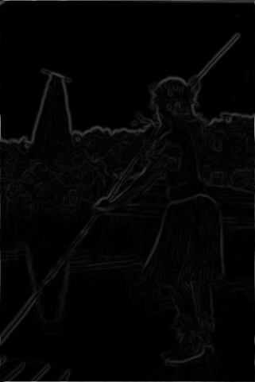
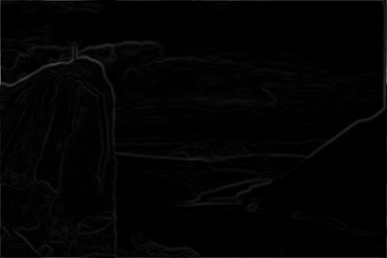

## Contour Detection

1. **Method Description.** In Part 1, I had to pad the image to get rid of the artifacts at the edge. For that purpose I used wrapping at boundaries.

   In Part 2, I did gaussian filtering to smooth the image. I tried different $`\sigma`$ values, the best result achieved at $`\sigma`$ =1.4.

   In Part 3, I implmented non-maximum suppression. If the magnitude of the gradient of pixel was greater than certain threshold, I looked at the values in the direction of the gradient. If the pixel value was smaller than those in the direction of the gradient I suppress the pixel.

2. **Precision Recall Plot.**  Use [contour_plot.py](contours/../contour_plot.py) to add curves for the different methods that you implemented into a single plot.
   
   

      
   

3. **Results Table.**  Present the performance metrics for each implementation part in a table format

   | Method | overall max F-score | average max F-score | AP | Runtime (seconds) |
   | ----------- | --- | --- | ---  | --- |
   | Initial implementation | 0.52 | 0.56 | 0.43 | 0.008 |
   | Warm-up [remove boundary artifacts | 0.53 | 0.56 | 0.46 | 0.015 |
   | Smoothing | 0.56 | 0.58 | 0.42 | 0.018 |
   | Non-max suppression | 0.60 | 0.62 | 0.59 | 0.59 |
   | Test set numbers of best model [From gradescope] | 0.60 | 0.62 | 0.59 | 0.59 |

4. **Visualizations.** 
   

      
      
      
      
   

   

      
      
      
      
   

   

      
      
      
      
   

5. **Bells and Whistles.** 

   I tried implementing hysterisis. If the value of the pixel was smaller than the lower threshold, suppress it. If the edge is weak and one of the neighbouring pixels has a value grater than higher threshold, ransform weak edge to the strong edge. However, my results after hystersis were slightly worse than those after nms. 
   
   | Method | overall max F-score | average max F-score | AP | Runtime (seconds) |
   | ----------- | --- | --- | ---  | --- |
   | Best base Implementation (from above) | 0.60 | 0.62 | 0.59 | 0.59 |
   | Bells and whistle (1) [extra credit]) | 0.60 | 0.61 | 0.54 | 1.61
   | Bells and whistle (2) [extra credit]) | | | |
   | Bells and whistle (n) [extra credit]) | | | |