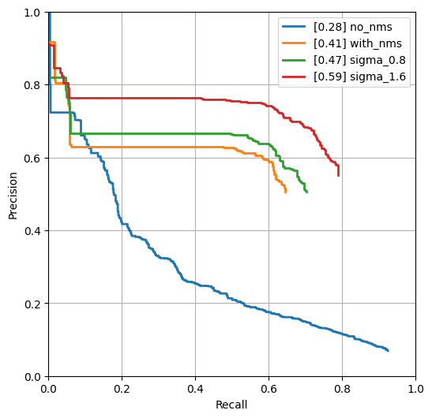
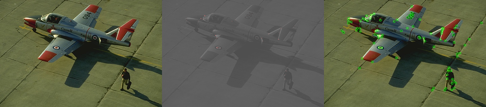
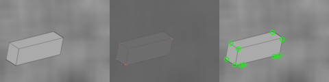

## Corner Detection

**NOTE:** All values and figures in this template are examples that you will need to replace with your own results

1. **Method Description.** In this task I implemented Harris corner detection. First step was to compute derivatives of the images. Then second moment od the derivatives were computed. I used Gaussian weights and convoluted through Ixx, Iyy and Ixy to compute response values. I used non-maximum supression to get rid of weak corners. Final results are shown below.

2. **Precision Recall Plot.** 

   

      
   

3. **Results Table.** Performance metrics

   | Method | Average Precision | Runtime |
   | ------ | ----------------- | ------- |
   | Random | 0.001 | 0.001   |
   | Harris w/o NMS | 0.28 | 0.08 |
   | Harris w/ NMS | 0.41 | 0.95 |
   | Hyper-parameters tried (1) | 0.46 | 0.9 |
   | Hyper-parameters tried (2) | 0.59 | 0.9 |
   | Test set numbers of best model [From gradescope] | 0.59 | 0.9 |

   Hyper-parameters (1): $`\sigma`$ = 1.6, $\alpha$ = 0.05'
   Hyper-parameters (2): $`\sigma`$ = 0.8, $\alpha$ = 0.06'

4. **Visualizations.** Visualization on 3 images. 

   

      
   

   

      
   

   

      
   

My corner detector is not perfect in detecting corners in cube image. It might be due to the background of image. It has some sharp transitions. I think detector performed well in airplane image. It could have detected additional corners though. As for the last image, I think it has done great job.

5. **Bells and Whistles.** *TODO*: Include details of the bells and whistles that you
   tried here.

   *TODO*: Present the performance metrics for the bells and whistles in a table format

   | Method | Average Precision | Runtime |
   | ------ | ----------------- | ------- |
   | Best base Implementation (from above) | | |
   | Bells and whistle (1) [extra credit]) | | |
   | Bells and whistle (2) [extra credit]) | | |
   | Bells and whistle (n) [extra credit]) | | |